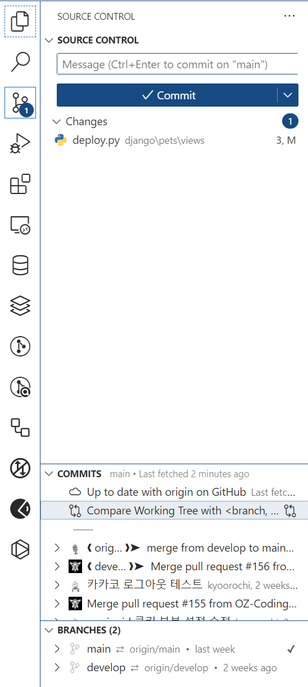
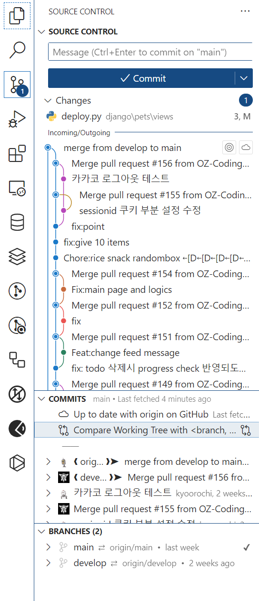
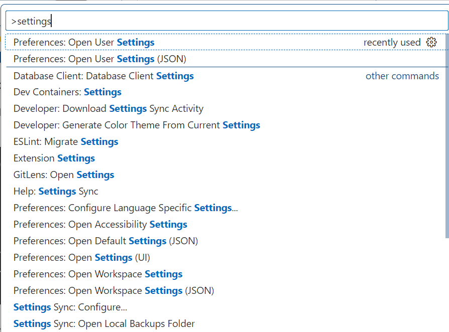
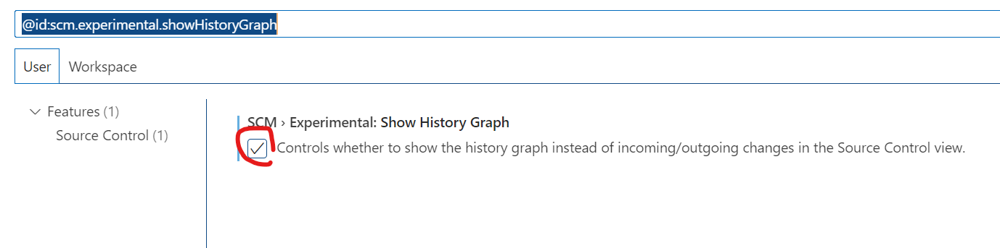

# VSCODE Source Control 업데이트

이제 VSCODE Source Control에서 기본 세팅으로 Git Graph를 볼 수 있다. 와우~!

### 기존 Source Control

### 업데이트된 VSCODE Source Control

# 설정하기

### 윈도우

- `F1`키
- `settings` 입력 > `Preferences: Open User Settings`

- 검색창에 `@id:scm.experimental.showHistoryGraph` 입력
- `SCM > Experimental: Show History Graph` 옵션 클릭

